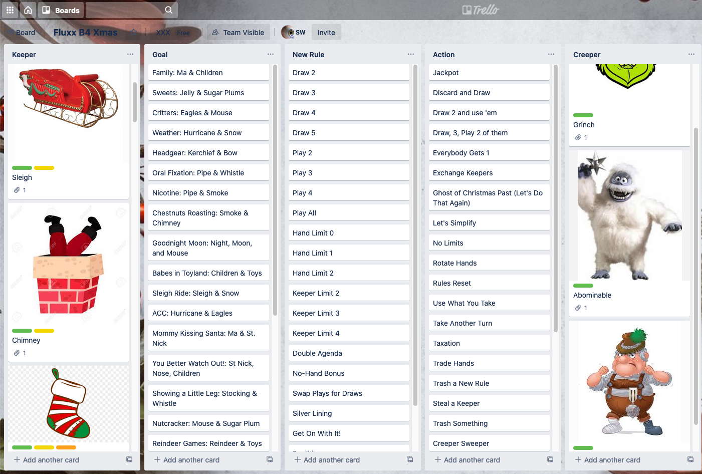
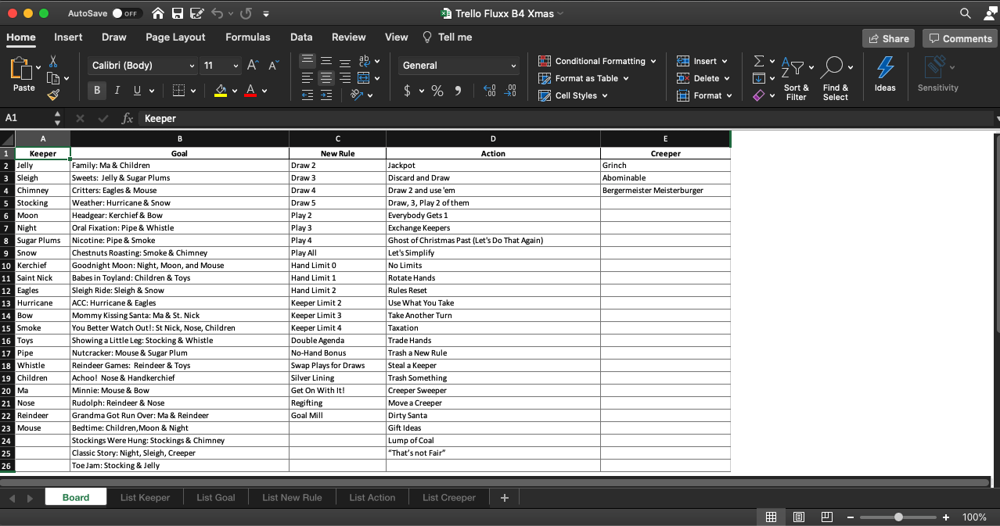
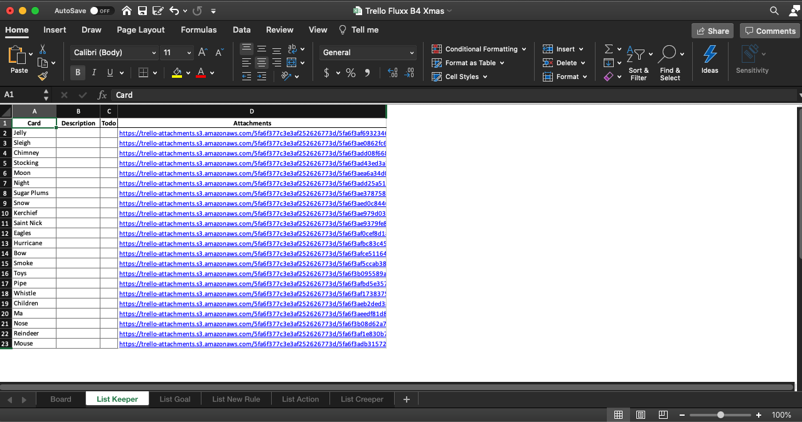

# Trello Dump

Trello Dump is a utility to dump the contents of a Trello board to an Excel spreadsheet.

Trello [trello-url](https://trello.com/) is a terrific tool and I use it a lot in the office and at home.
But there are times when I would like to export all of the data that I have added to my boards, lists and card.
Fortunately, trello has a very good API
and [py-trello](https://pypi.org/project/py-trello/) provides a nice python wrapper for it.

Trello Dump uses these tools and pandas to allow the user to select one of their boards and export it to an Excel workbook.


## Installation

### Manual

```bash
  $ git clone https://github.com/John-Lee-Cooper/trello-dump.git
  $ cd trello_dump
  $ python setup.py install
```

## Usage

```bash
$ trellod
```

Once you have provided the Oauth Keys necessary to access your Trello boards,
Trello Dump will present a list of all of your active boards and prompt you to select one.
Here is one of my boards I was using to build a Fluxx Deck
(See [Fluxx_Maker](https://github.com/John-Lee-Cooper/fluxx_maker)):




Once you have selected a board, Trello Dump will create an Excel spreadsheet in your local directory
name Trello <Board>.xlsx and open it.
The first worksheet will contain a summary of the board: 
a list in every column and that list's cards in the following rows:



The remaining worksheets will contain details of the cards in each of the boards list:
    * Card Name
    * Card Descriptions
    * Card ToDo lists
    * Card Attachment (links)




## Todo

## Written by

* John Lee Cooper
* John.Lee.Cooper@gatech.edu

